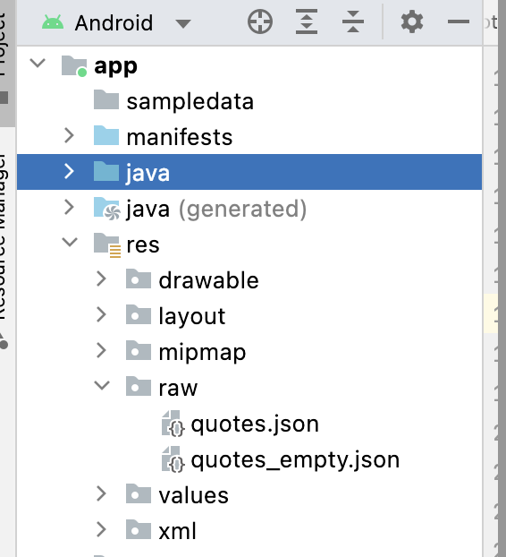

# API-Response-Mock-Okhttp-Retrofit
Mocking API response in okhttp using Interceptor

## To Enable mocking any API in our project we have to follow below steps


1. Add a json file in res/raw folder (quotes.json). Which will containn the mock response


   

2. Then Add this MockInterceptor into your project

```kotlin
class MockInterceptor : Interceptor {

    override fun intercept(chain: Interceptor.Chain): Response {

        val originalRequest = chain.request()
        
        if (BuildConfig.DEBUG) { 

             // 1 -> get necessary demo resposne as string. Here readFileResource give us the string from the file .
             // readFileResource takes the the file as parameter 
 
            val testResposne = readFileResource(
                AppApplication.applicationContext().resources.openRawResource(R.raw.quotes)
            )
            val emptyResponse = readFileResource(
                AppApplication.applicationContext().resources.openRawResource(R.raw.quotes_empty)
            )
            
            // Then we need to add here, which api we need mock response
            val uri = originalRequest.url.toString()
            val responseString: String = when {
                uri.contains("quotes?page=1") -> testResposne
                uri.contains("quotes") -> emptyResponse
                else -> null
            } ?: return chain.proceed(originalRequest)

          

            return chain.proceed(originalRequest)
                .newBuilder()
                .code(200) // if need want to change response code . we can change here
                .protocol(Protocol.HTTP_2)
                .message(responseString)
                .body(
                    ResponseBody.create(
                        "application/json".toMediaTypeOrNull(),
                        responseString.toByteArray()
                    )
                )
                .addHeader("content-type", "application/json")
                .build()
        } else {
            return chain.proceed(originalRequest)
        }
    }


}
```
Here is the readFileResource function. 

```kotlin
  fun readFileResource(inputStream: InputStream): String {
        val builder = java.lang.StringBuilder()
        val reader = InputStreamReader(inputStream, "UTF-8")
        reader.readLines().forEach {
            builder.append(it)
        }

        return builder.toString()
    }

```

3. Then we need to add this interface in our Okhttp builder . 


```kotlin
             OkHttpClient.Builder()
                    .addInterceptor(MockInterceptor())
                    .connectTimeout(30, TimeUnit.SECONDS)
                    .readTimeout(30, TimeUnit.SECONDS)
                    .writeTimeout(30, TimeUnit.SECONDS)
                    .build()

```

   

